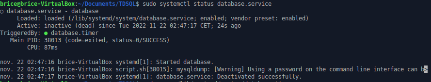

# Configurer le service

Pour configurer le service je me suis fié au tutoriel suivant:

https://tecadmin.net/run-shell-script-as-systemd-service

Je commence par m'accorder les droits sur le fichier:

````shell
sudo chmod +x script.sh
````

Je créé ensuite le fichier database.service et je le sauvegarde dans /lib/systemd/system/:

````shell
sudo nano /lib/systemd/system/database.service
````

J'écris ensuite le script pour le service qui se trouve dans le fichier: dump-database.service ainsi que le timer dans dump-database.timer

Puis je réalise ces commandes pour activer le service:
````shell
sudo systemctl daemon-reload

sudo systemctl enable database.service

sudo systemctl start database.service

sudo systemctl status database.service
````


De même pour le timer:

````shell
sudo systemctl daemon-reload

sudo systemctl enable database.timer

sudo systemctl start database.timer

sudo systemctl status database.timer
````


Le programme s'execute correctement, je suis content.


